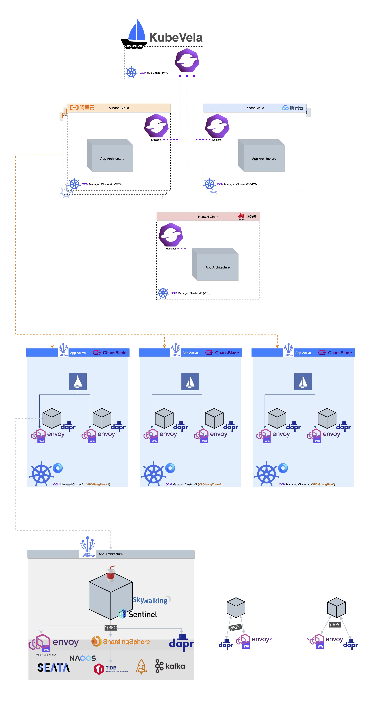

# One Person Company
一人公司：一个人就有可能运维一家公司，组合 Cloud Native 并完整设计技术架构（CNCF + Alibaba）；抓大放小、自顶而下、面向终态。

- CNCF landscape(https://github.com/cncf/landscape https://landscape.cncf.io)
- Alibaba Open Source(https://github.com/Alibaba)

或能提供一个踏上开源社区、持续学习的方向。TODO 逐步补充：架构图.jpg、实践说明.md

## Infrastructure Components eg: 

### Cluster Cloud Ops
- KebeVela(OAM https://github.com/oam-dev/kubevela)
  - Terraform(https://www.terraform.io) IaC: Infrastructure as Code
- Open Cluster Management(https://github.com/open-cluster-management-io/OCM https://open-cluster-management.io)

### Cloud Deliver
- Sealer(https://github.com/alibaba/sealer)

### Cloud
-  Alibaba Cloud
-  Tecent Cloud
-  Huawei Cloud
- Private Cloud

### Cloud Native Container
-  Istio(https://github.com/istio/istio)
-  Envoy(https://github.com/envoyproxy/envoy)
  -  WebAssembly(https://github.com/WebAssembly/WASI)
-  Dapr(https://dapr.io)

-  Kubernetes(https://github.com/kubernetes/kubernetes)
  -  OpenKruise(https://github.com/openkruise/kruise)
  -  etcd(https://etcd.io)
- Containerd(https://github.com/containerd/containerd)

### Observability(Metrics Tracing Logging)
-  OpenTelemetry(https://opentelemetry.io)
-  Prometheus(https://prometheus.io)
-  Grafana(https://grafana.com)
-  Kibana(https://www.elastic.co/cn/elastic-stack)
-  ElasticSearch(https://www.elastic.co/cn/elasticsearch)
  - fluentd(https://github.com/fluent/fluentd)
-  SkyWalking(https://github.com/apache/skywalking)

### High Avaliable
-  ChaosBlade(https://github.com/chaosblade-io/chaosblade)
- Takin(https://github.com/shulieTech/Takin) Performance test for full-links.
-  AppActive(https://github.com/alibaba/Appactive)

### Application
- 🥤 COLA(App Architecture https://github.com/alibaba/COLA)

-  Nacos(https://github.com/alibaba/nacos)
- Dubbo(https://github.com/apache/dubbo)
- Sentinel(https://github.com/alibaba/Sentinel)
-  Seata(https://github.com/seata/seata)
-  RocketMQ(https://github.com/apache/rocketmq)
-  ShardingSphere-JDBC(https://github.com/apache/shardingsphere)

## Operating System
- OpenAnolis(https://openanolis.cn)

## Infrastructure Components Picture

部分组件并不能很好展现在架构图中，例如上述的 Observability 云原生可观测性至关重要而无处不在。

面向终态同时包含着当下的最佳实践，例如尚未成熟的产品 dapr，分布式应用运行时可以把应用之外的大多中间件都囊括（例 RocketMQ）；但当下的 Mesh 实践依旧不够成熟，所以还是描述出独立的依赖较为直观；故大致上数据代理逐步向 envoy 演进，MiddlewareMesh 向 dapr 演进。

自顶而下地描述：
- 多云(集群)的发布部署由 KubeVela 负责，仅 CD 不详述 CI；
- OCM 联通多云的 Kubernetes 集群，无论是阿里云、华为云、腾讯云、私有云等，被管理端的 Klusterlet 主动链接中控 OCM Hub，后可以双工通讯。
- 云(集群)交付由 Sealer 集群镜像技术支持，第一样例是[阿里云 ACK Distro 发行版](https://github.com/AliyunContainerService/ackdistro)；
- 每个 Kubernetes 集群都增强，OpenKruise, Istio 等 CRD+Operator。
- 集群/容器高可用： ChaosBlade 混沌工程持续的真实演练
- 应用高可用：AppActive 单元化容灾能力 + 全量路压测-生产性能测试/功能测试。
- Application 部分还能更详尽地细化，应用的代码结构仅以 COLA 为 Java 例子说明。
- gRPC 来实现所有跨语言的调用，语言中立、平台无关。

:v0.1.0

